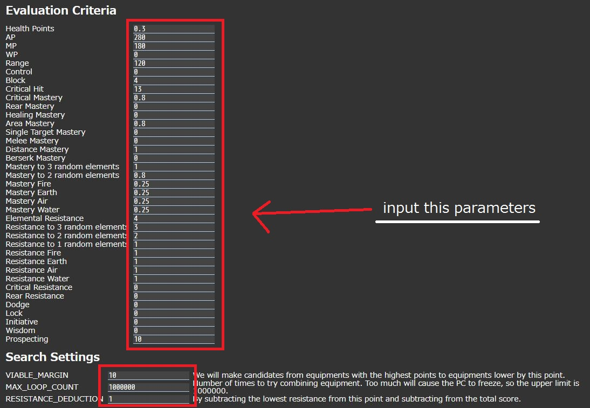
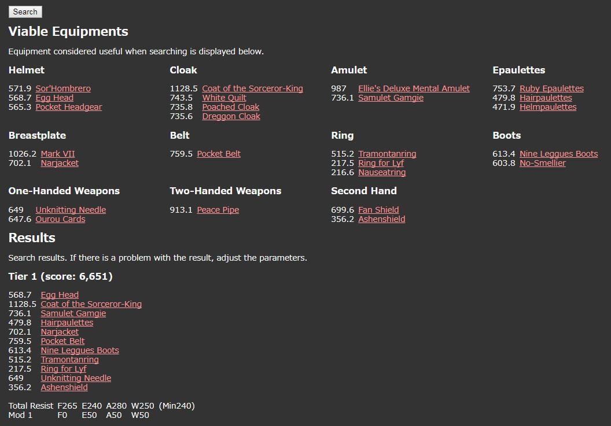

# how to use
## 1. input the parameters.

## 2. click search button.

## 3. you will get better equipment set information.


# how to build
## 1. get equipments source html file from official site.
```
$ ./tools/download-html.sh
$ ls ./dest/html/
armors.html  weapons.html
```
## 2. scrape equipments data from html file.
```
$ ./tools/equipment-parser.py
$ head -10 ./dest/data/equipment.json
{
    "Helmet": [
        {
            "url": "/en/mmorpg/encyclopedia/armors/21916-sor-hombrero",
            "stats": {
                "Dodge": "40",
                "Resistance Earth": "55",
                "Mastery to 3 random elements": "120",
                "Distance Mastery": "125",
                "Range": "1",
...
```
## 3. build client source files
```
$ grunt build
Running "eslint:target" (eslint) task

Running "jade:source" (jade) task
>> 1 file created.

Running "less:files" (less) task
>> 1 stylesheet created.

Running "copy:res" (copy) task
Copied 1 file

Running "copy:data" (copy) task
Copied 1 file

Running "concat:scripts" (concat) task

Done.
$ ls dest/build/
index.html  res  scripts  styles
```
## 4. publish the build file to a web server (like httpd).